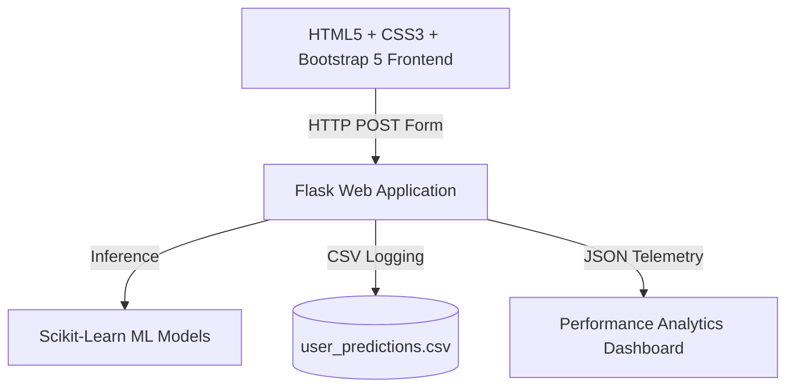

# OptiCrop – Smart Agricultural Production Optimization Engine

OptiCrop is an intelligent, machine learning-based agricultural recommendation system designed to help farmers, agricultural researchers, and agribusinesses optimize crop production. The engine processes environmental and soil parameters to recommend the most suitable crop, predict expected crop yield, classify soil conditions, and provide actionable soil replenishment prescriptions.

---

## 🏛️ System Architecture Topology

The application is built as a complete, lightweight, and responsive web application using the following stack:



* **Frontend**: HTML5, Vanilla CSS (Glassmorphism & animations), Bootstrap 5, Bootstrap Icons.
* **Backend**: Flask web framework, modular Python endpoints, Jinja2 templating.
* **Machine Learning & Analysis**:
  * **Classifier Models**: K-Nearest Neighbors (KNN), Logistic Regression, Decision Tree, Random Forest (Winning model selected for prediction).
  * **Clustering**: K-Means Clustering for soil categorization.
  * **Regressor**: Random Forest Regressor for crop yield forecasting.
  * **Data Processing**: Scikit-Learn (StandardScaler, LabelEncoder), Pandas, NumPy.
  * **Analytics Plotting**: Matplotlib & Seaborn.
* **Storage**: CSV-based data persistence (`datasets/user_predictions.csv`) logging user queries and predictions for future analytics.

---

## ⚙️ Quick Start Installation Guide

### Standalone Local Setup

#### Step 1: Set Up Python Virtual Environment
Ensure you have Python 3.10+ installed. In your terminal, run:

```bash
# Create virtual environment
python -m venv .venv

# Activate virtual environment
# On Windows (PowerShell):
.venv\Scripts\Activate.ps1
# On macOS/Linux:
source .venv/bin/activate
```

#### Step 2: Install Dependencies
```bash
pip install -r requirements.txt
```

#### Step 3: Run the Data Generation & Model Training Pipeline
To generate the agricultural datasets and train the machine learning models:

```bash
# 1. Generate synthetic soil and yield datasets
python generate_datasets.py

# 2. Train all models, compare accuracies, and generate visualization plots
python train_models.py
```
This generates:
* Pickled model artifacts under `models/` (`best_model.pkl`, `scaler.pkl`, `label_encoder.pkl`, `kmeans_model.pkl`, `yield_model.pkl`, `yield_encoders.pkl`, `metadata.pkl`).
* Model evaluation plots under `static/images/` (`model_comparison.png`, `confusion_matrix.png`, `feature_importance.png`).

#### Step 4: Run Flask Web Application
```bash
python app.py
```
Open your browser and navigate to `http://localhost:5000` to access the OptiCrop Optimizer dashboard.

---

## 🧪 Running Automated Unit Tests

The test suite validates home routing, classification endpoints, persistence logic, and API health status.

```bash
# Execute unit tests with pytest
python -m pytest tests/
```
All tests execute successfully and verify that predictions are accurately recorded to the user data storage.

---

## 📁 Repository Directory Structure

```
SmartBridge/
├── .venv/                   # Python virtual environment (ignored by git)
├── datasets/                # Agricultural CSV datasets and predictions log
│   ├── crop_recommendation_dataset.csv
│   ├── crop_yield_dataset.csv
│   └── user_predictions.csv
├── models/                  # Serialized pickle (.pkl) model artifacts
│   ├── best_model.pkl
│   ├── kmeans_model.pkl
│   ├── label_encoder.pkl
│   ├── metadata.pkl
│   ├── scaler.pkl
│   ├── yield_encoders.pkl
│   └── yield_model.pkl
├── static/                  # Static assets (CSS, images, visual plots)
│   ├── css/
│   │   └── style.css
│   └── images/
│       ├── confusion_matrix.png
│       ├── feature_importance.png
│       └── model_comparison.png
├── templates/               # Jinja2 HTML layout files
│   ├── dashboard.html
│   ├── index.html
│   └── result.html
├── tests/                   # Python test suite scripts
│   └── test_app.py
├── .gitignore               # Version control ignore specifications
├── app.py                   # Main Flask backend controller
├── generate_datasets.py     # Script to generate raw datasets
├── requirements.txt         # Project package requirements list
└── train_models.py          # Machine learning model training script
```
